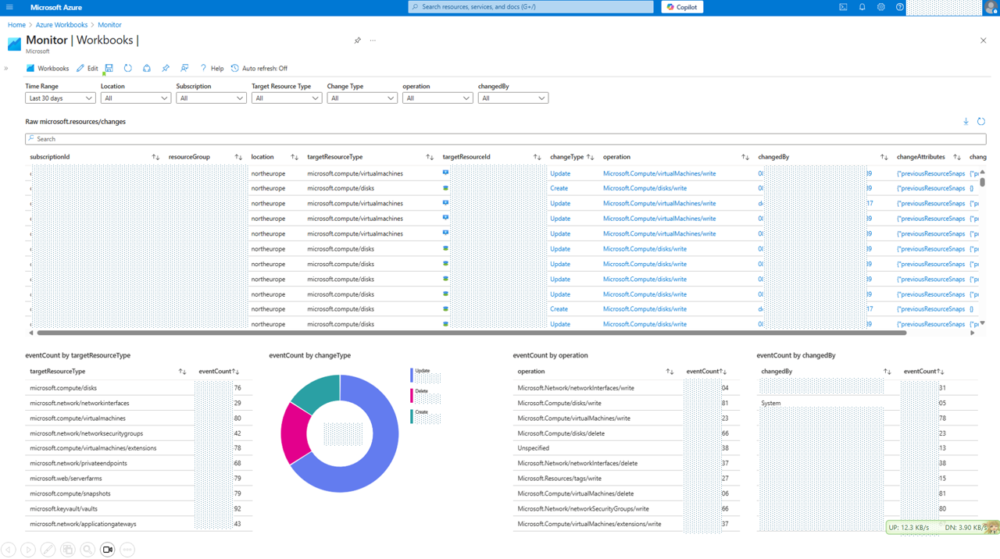

# Azure Monitor Workbook - Resources Changes

This Azure Workbook uses the powerful `resourcechanges` table from Azure Resource Graph to display a history of changes in your environment. 

By querying this table, the workbook shows **what was modified, who made the change, and when it happened**.

> [!NOTE]  
> The Azure Resource Graph `resourcechanges` table provides detailed insights into what changed in your resources over time, while Activity Logs capture all control plane operations performed on those resources—including both successful and failed actions—for broader auditing and monitoring purposes.

**Workbook illustration**:

Sources:
* [ARM Template](./src/arm_template.json)
* [Gallery Template](./src/gallery_template.workbook)